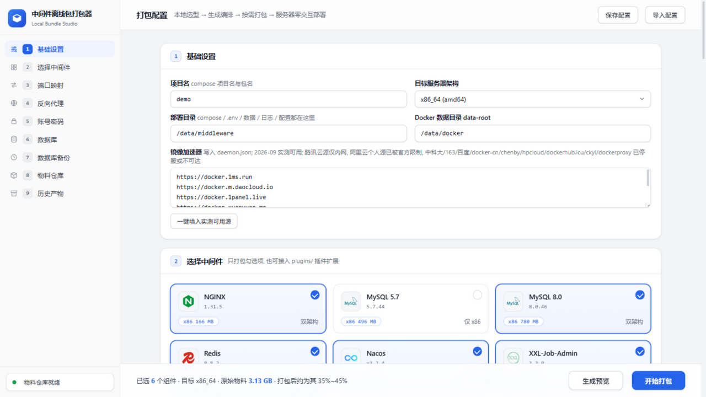
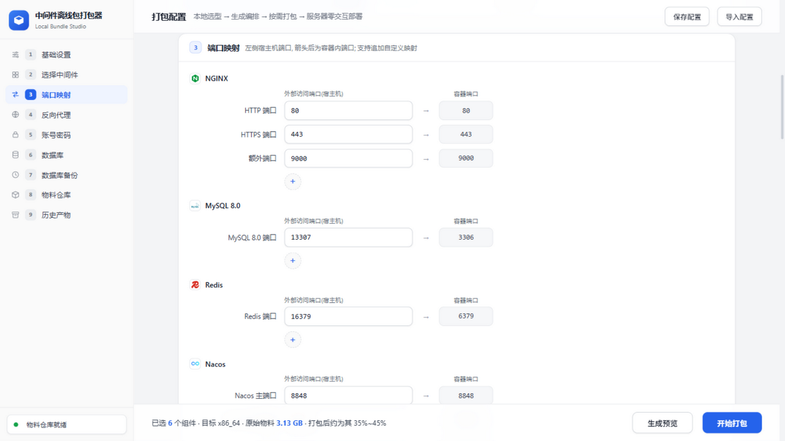
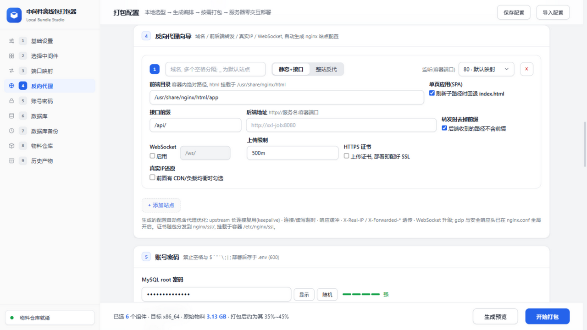
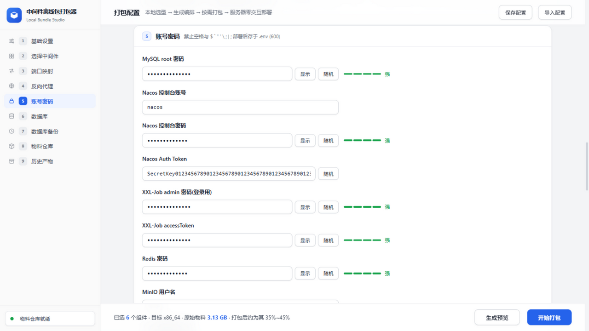
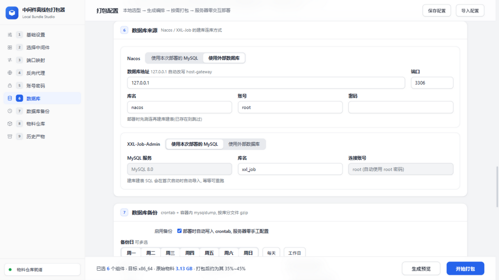
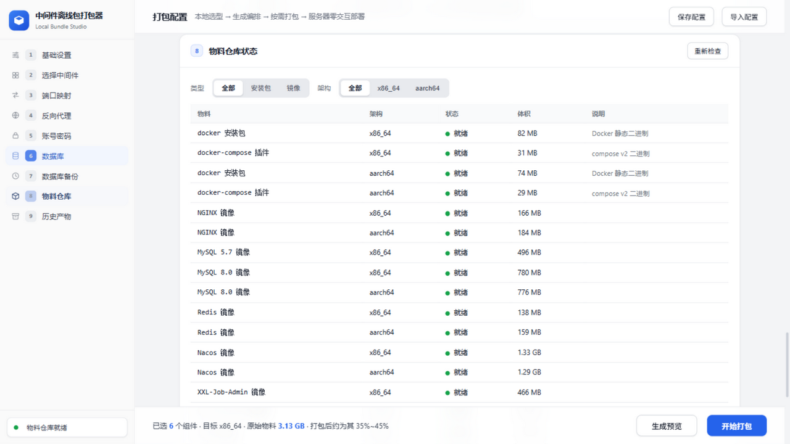
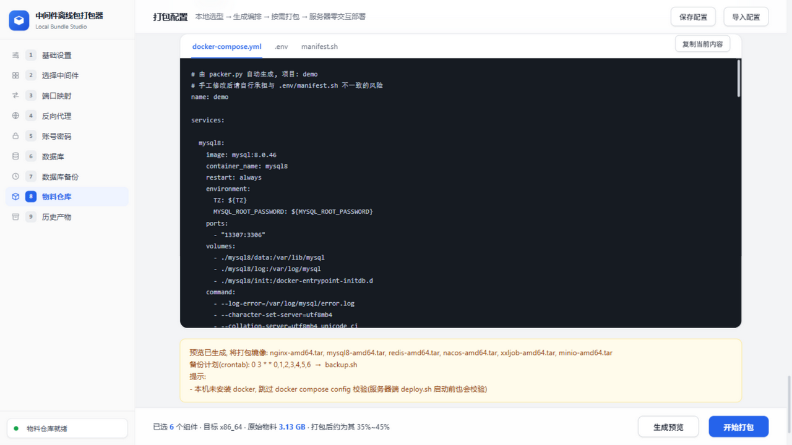

# 中间件离线部署包 (Local Bundle Studio)

在本地 Web 界面上选好中间件、端口、密码、数据库、备份策略，一键打出**只含本次所需物料**的离线包；
服务器上解压后执行 `./deploy.sh` 一条命令，全程零交互完成 Docker/Compose 离线安装和全部中间件部署，
部署完自动生成《部署报告》并贴出日常运维命令。

> 为谁而生：内网/隔离机房/无公网的服务器交付场景。不需要服务器能上网，不需要服务器预装任何网络工具，
> 不需要在服务器上回答任何问题——所有决策在打包时已完成。

**🌐 在线演示**：<https://litianyanaa-pixel.github.io/middleware-offline-deploy/packer.html>
（静态演示版：界面与配置流程可完整体验；打包/预览/物料检查需要本地后端）
项目主页：<https://litianyanaa-pixel.github.io/middleware-offline-deploy/>

> 改了前端后同步演示站：`python tools/update_pages.py`，再提交推送 docs/ 即可。

```
本地(Windows / macOS / Linux)                  服务器(离线内网)
┌────────────────────────────────┐  一个 tar.gz  ┌───────────────────────────┐
│ python packer.py  Web 打包器    │ ───────────→ │ tar -xzf xxx.tar.gz       │
│ (生成 compose/.env/manifest/   │  + .sha256    │ cd xxx                    │
│  nginx 站点/备份策略/SQL)       │  U盘/内网传输  │ ./deploy.sh   ← 只此一条   │
└────────────────────────────────┘              └───────────────────────────┘
```

## ✨ 功能亮点

- **零交互部署**：端口、密码、数据库来源、备份策略全部在打包时决定，服务器上不问任何问题
- **按需打包**：只打包勾选的中间件和对应架构，典型项目（nginx+mysql8+redis+xxljob）约 0.7GB，不搬全量仓库
- **幂等可重跑**：deploy.sh 重复执行安全——已装 Docker 跳过、已有表跳过导库、自己的端口占用放行、旧配置自动备份
- **不挑服务器**：磁盘/端口预检只用 `df/du` 和内核 `/proc/net/tcp(6)`，HTTP 健康实测 `curl→wget→bash /dev/tcp` 三级降级——精简/离线系统没装任何网络工具也能跑
- **健康实测**：容器健康检查 + 宿主机 HTTP 实测双保险，每项结果 ✓/✗ 打进部署摘要和部署报告
- **部署报告**：部署完成自动在部署目录生成 `部署报告.txt`（环境/清单/健康/账号/备份/运维命令），每次重跑自动覆盖
- **反向代理向导**：勾选 NGINX 后按站点配域名/前后端转发/真实IP/WebSocket/上传限制，**HTTPS 证书随包分发**，部署即配好 SSL
- **数据库自动化**：Nacos/XXL-Job 建库建表 SQL 自动导入（本地库首启自动导，外部库先测连再导，已存在自动跳过）
- **定时备份 + 一键恢复**：crontab + 容器内 mysqldump 按库分文件 gzip，超出保留份数自动轮转；`restore.sh` 一条命令恢复指定库
- **镜像统一 tag**：tar 内镜像无论带什么仓库前缀/tag 后缀，自动归一为短名，并校验架构一致，不符拦截
- **插件化扩展**：新增中间件只需一个插件文件 + 镜像 tar，页面勾选/端口/密码表单/编排生成全自动纳入

## 🖼 界面导览

**基础设置 + 选择中间件**：项目名、部署目录、Docker 数据目录、镜像加速器（一键填入实测可用源）；按卡片勾选中间件，自动识别架构与体积。



**端口映射**：左侧宿主机端口、箭头后为容器内端口；每个服务都支持追加自定义映射，全局查重。



**反向代理向导**（勾选 NGINX 后出现）：按站点配置静态前端 + 接口转发，或整站反代；WebSocket、上传限制、HTTPS 证书上传、真实 IP 还原都是开关项。



**账号密码**：所有密码支持随机生成与强度提示；部署后以 600 权限存于 `.env`。



**数据库来源 + 定时备份**：Nacos/XXL-Job 可选"本次部署的 MySQL"（自动导库）或外部数据库（127.0.0.1 自动改写 host-gateway）；备份策略随包分发为 crontab。



**物料仓库状态**：本地 `warehouse/` 的安装包与镜像按架构盘点，缺什么一目了然。



**生成预览**：打包前可直接查看生成的 docker-compose.yml / .env / manifest.sh。



## 📦 一、本地打包

```bash
python packer.py            # 打开 http://127.0.0.1:8765 (纯标准库, 无需装依赖)
```

页面流程：项目名/架构 → 勾选中间件 → 改端口（含自定义映射）→ 反向代理向导（勾选 NGINX 时）→
设密码（可随机生成）→ Nacos/XXL-Job 选数据库 → 配置备份策略 → 生成预览 → 开始打包。

- 产物：`dist/<项目名>-<架构>-<日期>-<时分>-offline.tar.gz`，同名 `.sha256` 校验文件一并生成
- 配置自动保存在浏览器本地，下次打开自动恢复；右上角可导出/导入 JSON 配置，方便团队复用
- 本机装有 docker 时会自动执行 `docker compose config` 校验生成的编排文件

命令行方式（CI/无人值守）：

```bash
python packer.py --config tests/pack_smoke_config.json   # 用 JSON 配置直接打包
python packer.py --example                               # 生成样例配置
python packer.py --port 8765 --no-browser                # 指定端口/不自动开浏览器
```

### 打包内容物

```
xxx-offline/
├── deploy.sh            # 服务器端部署脚本(零交互/幂等)
├── manifest.sh          # 全部部署决策(端口/密码/数据库/探测清单), deploy.sh 的决策来源
├── manifest.json        # 同上(JSON 形式, 用于留档比对)
├── docker-compose.yml   # 按勾选项生成的编排
├── .env                 # 环境变量(含密码, 包内 600)
├── images.txt           # 镜像 tar → 统一短名 的清单
├── images/              # 本次勾选的镜像 tar(按架构)
├── packages/<arch>/     # docker 静态二进制 + compose 插件(按架构)
├── conf/                # nginx 站点配置/证书、redis.conf 等生成配置
├── sql/                 # 需自动导入的建库 SQL(nacos/xxl-job)
├── backup.sh / backup.conf / restore.sh   # 备份与恢复(配置了备份/本地 MySQL 时)
└── README.txt           # 面向服务器操作者的两步说明
```

## 🛳 二、服务器部署

```bash
tar -xzf <项目名>-offline.tar.gz
cd <项目名>-offline
./deploy.sh                 # root 执行, 全程零交互
```

脚本行为（编号对应终端输出的【n/9】，全部幂等，可重复执行）：

0. **完整性校验**：若在解压目录/上级目录找到原始压缩包和 `.sha256`（两者一起拷贝过来即可），
   自动 `sha256sum -c`，不符直接终止；找不到包则跳过并提示手工校验命令
1. **安装 Docker/Compose**：离线安装并设开机自启（已装则跳过；已有 daemon.json 则不动，
   建议配置写到 `daemon.json.packer` 供人工合并）
2. **写 daemon.json**：数据目录(data-root)、日志轮转(100m×3)、加速器、cgroupdriver=systemd
3. **加载镜像并统一 tag**：tar 内镜像无论带什么仓库前缀（`docker.m.daocloud.io/...` 等）、
   tag 是否带 `-amd64/-arm64` 后缀，都会归一为短名（如 `mysql:8.0.46`），
   且校验镜像 architecture 与服务器架构一致，不符直接报错拦截
   （回归测试：`bash tests/normalize_sim_test.sh`）
4. **磁盘与端口预检**：只用 `df/du` 与内核 `/proc/net/tcp(6)` 完成，服务器**没装 `ss/netstat`
   等任何网络工具也能跑**（占用者是本套部署的容器则放行，支持重跑）；
   部署目录/Docker 数据目录所在分区装不下镜像包直接终止，偏紧时按"镜像体积×2+1GB"给出预留提示
5. **生成部署目录**：compose/.env/配置就位；重复部署时旧配置自动备份到包目录 `backup/<时间戳>/`；
   本地 MySQL 已有数据时禁止变更 root 密码（改了也不生效，直接拦下）
6. **数据库初始化**：已有表自动跳过；外部库在启动前导表（连接测试失败会明确报错）
7. **启动**：`docker compose up -d` 并打印访问摘要
8. **数据库定时备份**（打包时配置了才会装）：自动写入 crontab，mysqldump 在 mysql 容器内执行，
   按库分文件 gzip 导出（排除系统库），超出保留份数自动轮转；手工备份：部署目录下 `./backup.sh`
9. **健康实测**：有健康检查的容器（mysql/redis/minio/postgres）等转 healthy；
   nginx/nacos/xxl-job/minio 再从宿主机实测 HTTP 可用性（重试至 60s），客户端三级降级
   `curl → wget → bash 内建 /dev/tcp`（全缺也能跑，https 仅验证端口连通性），
   每项结果（✓/✗ + 排查提示）打进部署摘要，不通过不影响部署完成状态
10. **备份恢复脚本**：部署了本地 MySQL 时自动安装 `restore.sh` 到部署目录
11. **部署报告 + 运维命令**：自动在部署目录生成 `部署报告.txt`（环境信息/服务清单/健康实测/
    账号与安全/备份策略/日常运维命令），每次执行自动覆盖重写；终端同时直接贴出日志查看等常用命令

### 终端输出示例

```
[INFO]  【4/9】磁盘与端口预检
[INFO]  磁盘预检: /data 分区可用 51200MB (镜像 946MB, 建议预留 ≥ 2916MB)
[INFO]  端口 80 可用
[INFO]  端口 13307 可用
...
[INFO]  【9/9】服务健康实测
  mysql8       容器健康检查 ...
  nacos        HTTP 实测 http://127.0.0.1:8848/nacos/
...
[INFO]  部署完成! 部署目录: /data/middleware

  NGINX        http://10.0.0.5:80   (配置目录 /data/middleware/nginx)
  MySQL 8.0    10.0.0.5:13307  mysql -h<ip> -P13307 -uroot
  Redis        10.0.0.5:16379
  Nacos 控制台  http://10.0.0.5:8848/nacos  (账号见 .env)

  常用命令(在部署目录下执行, 日志用 docker compose 查看)
  cd /data/middleware
  docker compose ps                      # 容器状态一览
  docker compose logs -f                 # 跟看全部日志
  docker compose logs -f mysql8          # mysql8 日志
  ...
[INFO]  部署报告已生成: /data/middleware/部署报告.txt (每次执行 deploy.sh 自动重写)
```

### 日常运维命令

日志统一用 `docker compose` 查看（部署完终端也会原样贴出）：

```bash
cd /data/middleware            # 部署目录
docker compose ps              # 容器状态一览
docker compose logs -f         # 跟看全部日志
docker compose logs -f nacos   # 跟看单个服务日志(服务名=manifest 里的容器名)
docker compose restart         # 重启全部(单个: docker compose restart <服务名>)
docker compose down            # 停止(数据目录保留, 不删除)
```

## 💾 三、备份与恢复

备份策略在打包时配置（周几/几点/保留份数/目录），部署时自动写入 crontab；也可以手工执行：

```bash
cd /data/middleware
./backup.sh                 # 手工全量备份(按库分文件 gzip, 排除系统库)
./restore.sh list           # 列出全部备份(大小/时间)
./restore.sh mysql8 app_db  # 恢复该库最近一份备份
./restore.sh mysql8 app_db app_20260901_030000.sql.gz   # 恢复指定文件
```

- 恢复前自动把目标库当前内容做一次安全备份（`pre_restore_*.sql.gz`）
- 交互确认可加 `--yes` 跳过；backup.sh 与 restore.sh 共用文件锁，不会互相踩
- 当前备份/恢复仅覆盖 MySQL；PostgreSQL 插件暂未纳入，需要时可按 `pg_dumpall` 思路扩展

## 🔁 四、维护（升级中间件 / 新增中间件）

### 升级内置中间件
1. 新镜像放进 `warehouse/images/<中间件>/<版本>/<架构>.tar`
2. 改 `versions.json` 对应条目（版本号、路径、端口默认值）
3. 重新打包即可

### 新增中间件（可插拔接口）
1. 把镜像按架构放到 `warehouse/images/<中间件>/<版本>/<架构>.tar`
2. 复制 `plugins/_template.py` 为 `plugins/<中间件>.py`，按注释填 `SERVICE_KEY / META / compose_block`
3. 重启 `python packer.py`，页面勾选、端口、密码表单、compose 生成、镜像打包、部署摘要全自动纳入
   （接口契约见 `plugins/README.md`）

已落地的插件：**PostgreSQL 15.19**（`plugins/postgres.py`，双架构，默认端口 15432，
compose 自带 `pg_isready` 健康检查）。镜像 tar 放置位置：

```
warehouse/images/postgres/15.19/amd64.tar   ← postgres-15.19-amd64.tar 放这里
warehouse/images/postgres/15.19/arm64.tar   ← postgres-15.19-arm64.tar 放这里
```

## 🪞 五、镜像加速器实测结论（2026-09-09）

| 加速器 | 结果 |
|---|---|
| `https://docker.1ms.run` | ✅ 可用 (/v2/ 401 正常鉴权响应) |
| `https://docker.m.daocloud.io` | ✅ 可用 |
| `https://docker.1panel.live` | ✅ 可用 (匿名 manifest 200) |
| `https://docker.xuanyuan.me` | ✅ 可用 (匿名 manifest 200) |
| `https://hub.rat.dev` | ✅ 可用 |
| `https://docker.aityp.com` | ✅ 可用 |
| `sqy0etea.mirror.aliyuncs.com` | ❌ 阿里云已官方限制个人加速器(403 + 调整公告) |
| `mirror.ccs.tencentyun.com` | ⚠️ 仅腾讯云内网可用 |
| `docker.mirrors.ustc.edu.cn` / `registry.docker-cn.com` / `hub-mirror.c.163.com` / `mirror.baidubce.com` | ❌ 已停服/无响应 |
| `docker.chenby.cn` / `docker.hpcloud.cloud` / `dockerhub.icu` / `docker.ckyl.cn` / `dockerproxy.net` / `dhub.kubesre.xyz` / `hub.docker-mirror.cn` | ❌ 探测无响应(000) |
| `docker.1panel.top` | ⚠️ 429 限流激进, 不建议作为默认 |
| `docker.nju.edu.cn` | ❌ 403 (疑似仅教育网) |

页面默认预填实测可用的六个。注意：加速器只作为 `docker pull` 兜底，
**离线镜像包本身完全不依赖加速器**，可达性以打包机当时网络为准。

## ❓ 六、FAQ / 已知事项

**Q: 服务器是精简系统，没装 ss/netstat/curl，能部署吗？**
能。端口预检直接读内核 `/proc/net/tcp(6)`（任何 Linux 恒有），磁盘预检只用 `df/du`；
健康实测没有 curl/wget 时降级为 bash 内建 `/dev/tcp` 裸 HTTP 请求（https 仅验证端口连通性）。
全程不需要联网安装任何东西。

**Q: 重复执行 deploy.sh 安全吗？**
安全。已装 Docker 跳过安装；镜像已加载跳过；已有表跳过导库；端口被本套部署自己的容器占用视为可用；
旧 compose/.env/配置自动备份到 `backup/<时间戳>/`。唯一拦截：本地 MySQL 已有数据时不允许换 root 密码。

**Q: 为什么改了服务器上的配置后再次部署被覆盖/报错？**
打包器生成的配置带「由打包器生成」标记，重新部署时自动覆盖；无标记的人工修改不会被覆盖
（`nginx/ssl/wizard/` 子目录例外，整体覆盖，手工证书请放 `ssl/` 根目录）。
端口/密码等变更请走"本地改配置→重新打包→重新部署"，勿直接改服务器文件。

**其他已知事项**
- MySQL 5.7 官方无 arm64 镜像，打包器在 arm 架构下会禁用该项
- XXL-Job 控制台初始账号 `admin`，初始密码 = 打包时登记的"XXL-Job admin 密码"（部署 SQL 按该值初始化），登录后请修改
- Redis 内存上限默认不限制（需要时在 redis.conf 中取消 `maxmemory` 注释）
- 每个中间件都支持追加自定义端口映射，打包前全局查重
- 密码字符集限制：禁止 空格 `` $ ` " ' \ ; | ``（`$` 会破坏 compose 插值）；`#` 合法，.env 中会自动加引号
- Nacos/XXL-Job 连外部库时若填 `127.0.0.1/localhost`，compose 内自动改写为 `host.docker.internal`
  （host-gateway），请确认外部库监听 0.0.0.0
- SELinux 开启的服务器脚本会自动设置容器文件标签；若仍有挂载权限问题：
  `chcon -R system_u:object_r:container_file_t:s0 <部署目录>`
- 服务器兼容：bash 4.2+（CentOS 7）、systemd、x86_64/aarch64；内核需支持 overlay2
- 无论服务器是否已装 Docker，部署脚本都会确保 docker/containerd systemd 服务开机自启

## 🔐 七、安全

- `.env` 与 `manifest.sh` 含全部明文密码，包内权限 600，分发与留存注意管控
- `manifest.json` 为部署决策留档（含密码），建议随发布流程归档，不要进公共仓库
- 本仓库**不含**任何真实部署密码：`versions.json` 里的默认值仅作表单预填（建议打包时点"随机"生成）；
  XXL-Job 控制台初始密码在打包时按登记值自动写入初始化 SQL，无公开的固定口令
- 本仓库**不含**任何物料与产物：`warehouse/`（原始镜像/安装包）与 `dist/`（打包产物）已在 `.gitignore`
  排除，请按内部流程单独保管与传输

## 📁 八、目录结构

```
├── packer.py                  # 本地打包器(Web + CLI 双模式, 纯标准库)
├── packer.html                # Web 界面(侧边栏控制台)
├── packer_logos.js            # 中间件品牌 logo(data URI 内嵌)
├── versions.json              # ★ 物料目录: 版本/镜像路径/端口/密码字段 全部定义在这
├── plugins/                   # ★ 可插拔中间件插件目录(_template.py 为模板)
│   └── README.md              #   插件接口契约
├── server/
│   └── deploy.sh              # 服务器端部署脚本(打进每个离线包, 零交互/幂等)
├── templates/                 # nginx.conf / default.conf / redis.conf / index.html
├── sql/xxl-job.sql            # XXL-Job 建表脚本
├── tests/                     # 回归测试(镜像匹配模拟 / 冒烟打包配置)
│   └── normalize_sim_test.sh
├── tools/update_pages.py      # 同步 GitHub Pages 演示站(docs/)
├── docs/                      # Pages 站点源目录(落地页 + packer 前端副本 + 截图)
├── docs/images/               # README 截图
├── warehouse/                 # ★ 原始物料仓库(不进 git, 体积大)
│   ├── packages/x86_64/       #   docker-29.8.0.tgz, docker-compose-linux-x86_64
│   ├── packages/aarch64/      #   docker-29.8.0.tgz, docker-compose-linux-aarch64
│   └── images/<中间件>/<版本>/ #   amd64.tar / arm64.tar
├── dist/                      # 打包产物输出目录(不进 git)
└── legacy/deploy.sh           # 旧交互式脚本存档(已被新方案取代)
```
