# Middleware Offline Deploy (Local Bundle Studio)

[简体中文](README.md) | English | [Changelog](CHANGELOG.md)

Pick your middleware, ports, passwords, databases and backup policy in a local web UI, then build an **offline bundle containing only what you need**. On the server, extract it and run `./deploy.sh` — one command, zero interaction, installs Docker/Compose offline and deploys every middleware, then auto-generates a deployment report with day-to-day ops commands.

> Built for: air-gapped / isolated / no-public-network server delivery. The server needs no internet access, no network tools pre-installed, and never asks a single question — every decision is made at packing time.

**🌐 Live demo**: <https://litianyanaa-pixel.github.io/middleware-offline-deploy/packer.html>
(Static demo: the UI and configuration flow work fully; packing/preview/material checks need the local backend.)
Project home: <https://litianyanaa-pixel.github.io/middleware-offline-deploy/>

> After changing the frontend, sync the demo site with `python tools/update_pages.py`, then commit and push `docs/`.

```
Local (Windows / macOS / Linux)                Server (offline intranet)
┌────────────────────────────────┐  one tar.gz  ┌───────────────────────────┐
│ python packer.py  web packer    │ ───────────→ │ tar -xzf xxx.tar.gz       │
│ (compose/.env/manifest/nginx   │  + .sha256    │ cd xxx                    │
│  sites/backup policy/SQL)      │  USB/LAN      │ ./deploy.sh   ← just this │
└────────────────────────────────┘               └───────────────────────────┘
```

## ✨ Highlights

- **Zero-interaction deployment**: ports, passwords, database sources and backup policy are all decided at packing time; the server asks nothing
- **Pack only what you need**: only the selected middleware and architectures are bundled — a typical project (nginx+mysql8+redis+xxljob) is ~0.7GB, not the whole warehouse
- **Idempotent & re-runnable**: re-running deploy.sh is safe — skips installed Docker, skips imported tables, allows its own port bindings, auto-backs up old configs
- **Runs anywhere**: disk/port pre-checks use only `df/du` and the kernel's `/proc/net/tcp(6)`; HTTP health probes fall back through `curl → wget → bash /dev/tcp` — works even on stripped-down offline systems without any network tools
- **Real health checks**: container health checks + host-side HTTP probes, every result (✓/✗) goes into the deployment summary and report
- **Deployment report**: `部署报告.txt` (deployment report) auto-generated in the deploy directory (environment / inventory / health / accounts / backup / ops commands), rewritten on every run
- **Reverse proxy wizard**: with NGINX selected, configure sites by domain, static frontend + API forwarding, real IP, WebSocket, upload limits; **HTTPS certs ship inside the bundle**, SSL ready at deploy time
- **Database automation**: Nacos/XXL-Job schema SQL imported automatically (local DBs import on first boot, external DBs are connection-tested first, existing tables are skipped)
- **Scheduled backup + one-command restore**: independent backup plan per database (MySQL/PostgreSQL/MongoDB, separate crontabs), in-container native tools (mysqldump / pg_dump -Fc / mongodump), per-database compressed files with automatic rotation; `restore.sh` restores a database in one command
- **Unified image tags**: whatever registry prefix/tag suffix the tars carry, images are normalized to short names, with architecture mismatch intercepted
- **Plugin-based extension**: adding middleware takes one plugin file + image tars; checkboxes, port forms, compose generation and deploy summaries all pick it up automatically
- **Cluster modes**: MySQL 8.0 standalone / **primary-replica replication** (one master + one replica, GTID auto-sync, configured at deploy time); Redis standalone / **Sentinel HA** (master + replica + 3 sentinels, automatic failover)
- **Observability, closed loop**: Node Exporter (host metrics) + Prometheus + Loki/Promtail (container logs) + Grafana datasources/dashboards **pre-provisioned** — open Grafana after deploy and the host monitoring dashboard is already there
- **Message queue**: Apache Kafka (single-node KRaft, no ZooKeeper) + Kafka UI console

## 🖼 UI Tour

**Basics + middleware selection**: project name, deploy directory, Docker data root, registry mirrors (one-click fill with tested-working mirrors); select middleware by card with automatic architecture and size detection.

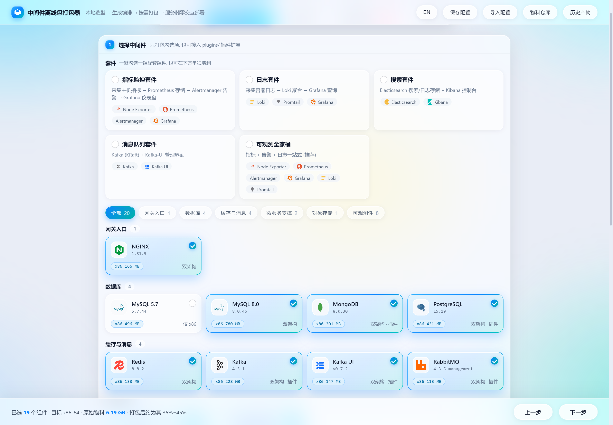

**Port mapping**: host port on the left, container port after the arrow; every service supports extra custom mappings with global duplicate checking.

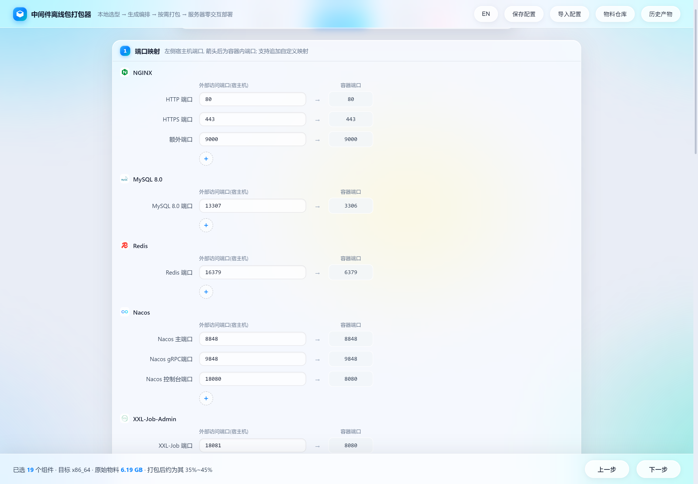

**Reverse proxy wizard** (appears when NGINX is selected): per-site static frontend + API forwarding, or full-site reverse proxy; WebSocket, upload limits, HTTPS certificate upload and real-IP restoration are all toggles.

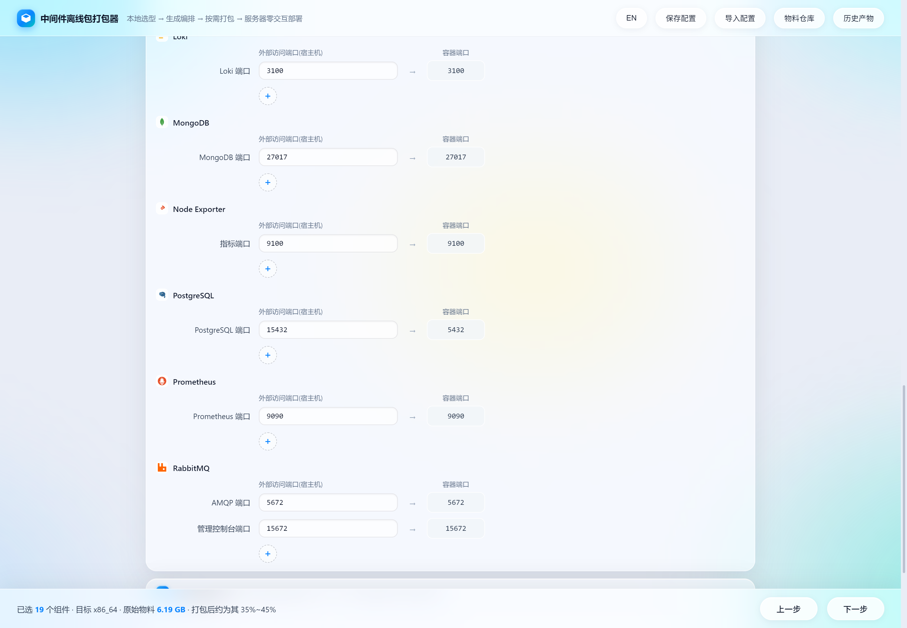

**Accounts & passwords**: every password supports random generation with strength hints; stored at permission 600 in `.env` after deployment.

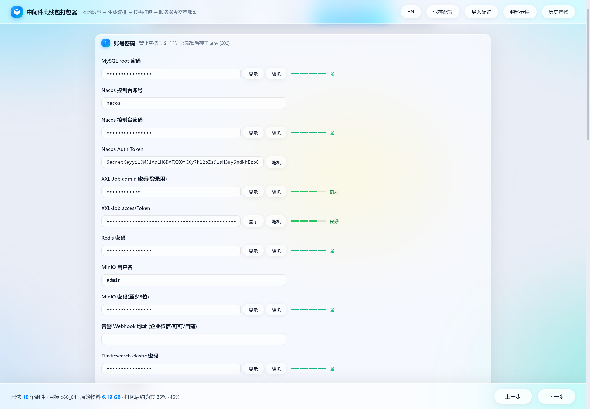

**Database sources + scheduled backup**: Nacos/XXL-Job can use "the MySQL deployed in this bundle" (auto import) or an external database (127.0.0.1 is auto-rewritten to host-gateway); backup policy ships in the bundle as crontab.

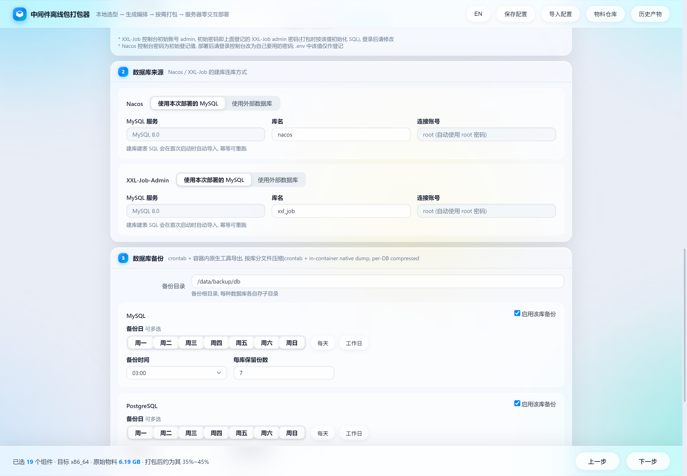

**Warehouse status**: local `warehouse/` packages and images inventoried per architecture — what's missing at a glance.

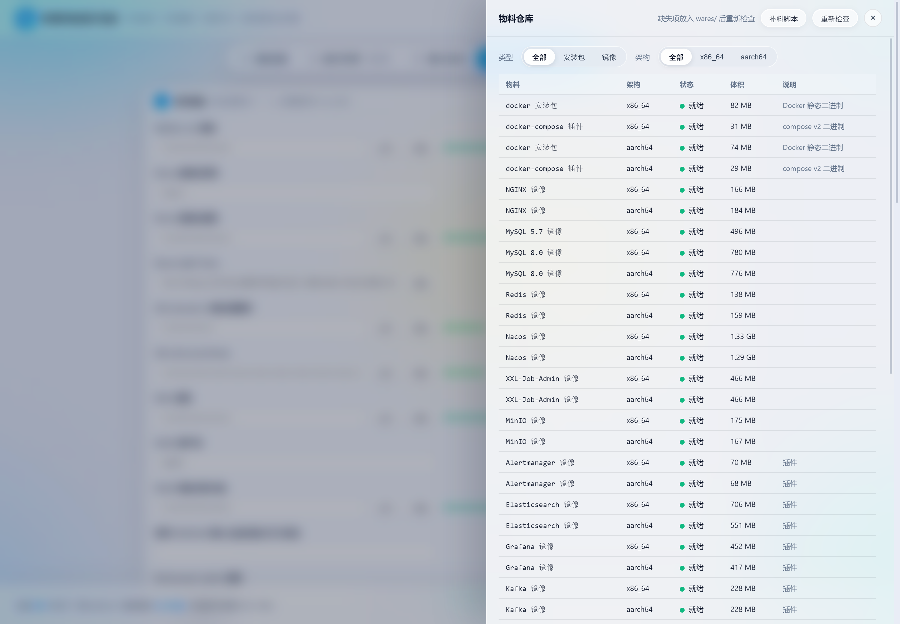

**Preview before packing**: inspect the generated docker-compose.yml / .env / manifest.sh before building.

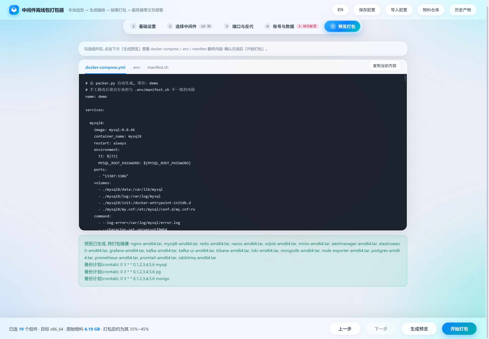

## 📦 1. Pack Locally

```bash
python packer.py            # opens http://127.0.0.1:8765 (stdlib only, no dependencies)
```

Page flow: project name/architecture → select middleware → adjust ports (incl. custom mappings) → reverse proxy wizard (when NGINX selected) → set passwords (random generation available) → choose DB for Nacos/XXL-Job → configure backup policy → preview → pack.

- Output: `dist/<project>-<arch>-<date>-<hhmm>-offline.tar.gz` with a matching `.sha256` file
- Config auto-saves in browser localStorage and restores on next visit; export/import JSON config from the top-right for team reuse
- If Docker is installed locally, `docker compose config` validates the generated compose file automatically

CLI mode (CI / unattended):

```bash
python packer.py --config tests/pack_smoke_config.json   # pack directly from a JSON config
python packer.py --example                               # generate a sample config
python packer.py --port 8765 --no-browser                # custom port / no browser
```

### Bundle Contents

```
xxx-offline/
├── deploy.sh            # server-side deploy script (zero-interaction / idempotent)
├── manifest.sh          # every deployment decision (ports/passwords/DB/probe list), deploy.sh's source of truth
├── manifest.json        # same, in JSON (for archiving and diffing)
├── docker-compose.yml   # orchestration generated from your selection
├── .env                 # environment variables (incl. passwords, 600 inside the bundle)
├── images.txt           # image tar → unified short-name manifest
├── images/              # selected image tars (per architecture)
├── packages/<arch>/     # docker static binaries + compose plugin (per architecture)
├── conf/                # generated configs: nginx sites/certs, redis.conf, etc.
├── sql/                 # schema SQL to auto-import (nacos/xxl-job)
├── backup.sh / backup.conf / restore.sh   # backup & restore (when configured / local MySQL)
└── README.txt           # two-step instructions for the server operator
```

## 🛳 2. Deploy on the Server

```bash
tar -xzf <project>-offline.tar.gz
cd <project>-offline
./deploy.sh                 # run as root, zero interaction
```

Script behavior (numbers match the terminal's 【n/9】 output, all idempotent, safe to re-run):

0. **Integrity check**: if the original archive and `.sha256` are found next to the extraction directory (copy both together), `sha256sum -c` runs automatically and aborts on mismatch; if not found it skips and prints the manual command
1. **Install Docker/Compose**: offline install with systemd enable (skipped if already installed; if a `daemon.json` exists it is left untouched — the recommended config is written to `daemon.json.packer` for manual merge)
2. **Write daemon.json**: data-root, log rotation (100m×3), mirrors, cgroupdriver=systemd
3. **Load images & normalize tags**: whatever registry prefix (`docker.m.daocloud.io/...` etc.) or `-amd64/-arm64` tag suffix the tars carry, images are normalized to short names (e.g. `mysql:8.0.46`); image architecture is validated against the server's — mismatch aborts
   (regression test: `bash tests/normalize_sim_test.sh`)
4. **Disk & port pre-checks**: uses only `df/du` and the kernel's `/proc/net/tcp(6)` — runs even on servers **without `ss/netstat` or any network tools** (ports occupied by this bundle's own containers are treated as free, supporting re-runs);
   if the partition holding the deploy directory or Docker data root can't fit the images it aborts; when tight, it suggests reserving "image size ×2 + 1GB"
5. **Generate deploy directory**: compose/.env/configs in place; on re-deploy old configs are backed up to `backup/<timestamp>/` in the bundle directory;
   if local MySQL already has data, changing the root password is blocked (it wouldn't take effect anyway)
6. **Database init**: existing tables are skipped; external DBs are imported before startup (connection failures raise a clear error)
7. **Start**: `docker compose up -d` and print an access summary
8. **Scheduled DB backup** (only if configured at packing time): written to crontab automatically; mysqldump runs inside the mysql container, per-database gzipped files (system DBs excluded) with automatic rotation beyond the retention count; manual run: `./backup.sh` in the deploy directory
9. **Health probes**: containers with health checks (mysql/redis/minio/postgres) are waited on until healthy;
   nginx/nacos/xxl-job/minio are additionally probed over HTTP from the host (retry up to 60s) with three-level fallback
   `curl → wget → bash built-in /dev/tcp` (works even if all are missing; https only verifies port connectivity);
   every result (✓/✗ + troubleshooting hints) goes into the summary; failures don't change the deployment completion status
10. **Restore script**: when local MySQL is deployed, `restore.sh` is installed into the deploy directory
11. **Report + ops commands**: `部署报告.txt` (deployment report) auto-generated in the deploy directory (environment / service inventory / health / accounts & security / backup policy / daily ops commands), rewritten on every run; common commands like log viewing are also printed to the terminal

### Sample Terminal Output

```
[INFO]  【4/9】Disk & port pre-checks
[INFO]  Disk check: /data partition 51200MB free (images 946MB, reserve ≥ 2916MB recommended)
[INFO]  Port 80 available
[INFO]  Port 13307 available
...
[INFO]  【9/9】Health probes
  mysql8       container health check ...
  nacos        HTTP probe http://127.0.0.1:8848/nacos/
...
[INFO]  Deployment complete! Deploy directory: /data/middleware

  NGINX        http://10.0.0.5:80   (config dir /data/middleware/nginx)
  MySQL 8.0    10.0.0.5:13307  mysql -h<ip> -P13307 -uroot
  Redis        10.0.0.5:16379
  Nacos console http://10.0.0.5:8848/nacos  (credentials in .env)

  Common commands (run in the deploy directory; view logs with docker compose)
  cd /data/middleware
  docker compose ps                      # all container states
  docker compose logs -f                 # follow all logs
  docker compose logs -f mysql8          # mysql8 logs
  ...
[INFO]  Report generated: /data/middleware/部署报告.txt (rewritten on every deploy.sh run)
```

### Daily Ops Commands

Logs are viewed uniformly via `docker compose` (also printed at the end of deployment):

```bash
cd /data/middleware            # deploy directory
docker compose ps              # all container states
docker compose logs -f         # follow all logs
docker compose logs -f nacos   # follow one service (service name = container name in manifest)
docker compose restart         # restart everything (single: docker compose restart <service>)
docker compose down            # stop (data directories are kept, nothing deleted)
```

## 💾 3. Backup & Restore

The backup policy is configured at packing time (day of week / hour / retention count / directory) and installed into crontab at deploy time; manual execution also works:

```bash
cd /data/middleware
./backup.sh                 # manual full backup (per-database gzip, system DBs excluded)
./restore.sh list           # list all backups (size/time)
./restore.sh mysql8 app_db  # restore the latest backup of that database
./restore.sh mysql8 app_db app_20260901_030000.sql.gz   # restore a specific file
```

- Before restoring, the target database's current content gets a safety backup (`pre_restore_*.sql.gz`)
- Skip the interactive confirmation with `--yes`; backup.sh and restore.sh share a file lock so they never collide
- Currently backup/restore covers MySQL only; the PostgreSQL plugin isn't covered yet — extend along the `pg_dumpall` approach if needed

## 🔁 4. Maintenance (Upgrade / Add Middleware)

### Upgrading built-in middleware
1. Put the new image in `warehouse/images/<middleware>/<version>/<arch>.tar`
2. Update the entry in `versions.json` (version, paths, default ports)
3. Pack again

### Adding middleware (plugin interface)
1. Save the image per architecture to `warehouse/images/<middleware>/<version>/<arch>.tar`
2. Copy `plugins/_template.py` to `plugins/<name>.py` and fill in `SERVICE_KEY / META / compose_block` per the comments
3. Restart `python packer.py` — the checkbox, port form, password form, compose generation, image packing and deploy summary all pick it up automatically
   (interface contract: `plugins/README.md`)

Shipped plugins (all dual-arch; images at `warehouse/images/<middleware>/<version>/<arch>.tar`;
after restarting the packer the warehouse table turns green and they become selectable):

| Plugin | Version | Default ports | Notes |
|---|---|---|---|
| PostgreSQL | 15.19 | 15432 | compose includes a `pg_isready` health check |
| RabbitMQ | 4.3.5-management | 5672 / 15672 | AMQP + management console, credentials in `.env` |
| MongoDB | 8.0.30 | 27017 | stable 8.0.x; root account only takes effect on first data-dir initialization |
| Prometheus | v3.14.0 | 9090 | default scrape config baked into the image, 15-day retention |
| Grafana | 13.2.1 | 3000 | admin credentials in `.env`; datasource `http://prometheus:9090` |
| Elasticsearch | 9.3.0 | 9200 | single node; `vm.max_map_count=262144` set automatically at deploy; security (auth) off by default (intranet) |
| Kibana | 9.3.0 | 5601 | **must match the Elasticsearch version**; auto-connects to the `elasticsearch` service on the same network |
| Node Exporter | v1.12.1 | 9100 | host metrics (CPU/memory/disk/network) |
| Loki | 3.7.7 | 3100 | log aggregation (single-node file storage), works with Promtail |
| Promtail | 3.6.11 | - | scrapes `/var/lib/docker/containers` and pushes to Loki |
| Kafka | 4.3.1 | 9092 / 9094 | KRaft single node; `kafka:9092` in-container, `localhost:9094` from the host |
| Kafka UI | v0.7.2 | 18090 | Kafka visual console, auto-connects to `kafka:9092` |

### Cluster Modes (MySQL primary-replica / Redis Sentinel)

With MySQL 8.0 (or 5.7) or Redis selected, a **deployment mode** chooser appears below the middleware cards:

- **MySQL primary-replica**: the primary keeps the service name `mysql8` (Nacos/XXL-Job connect to it as usual); the replica `mysql8-replica` is read-only (port 13308) with GTID auto-sync. The deploy script automatically: creates the repl account → `CHANGE REPLICATION SOURCE` on the replica (idempotent, skipped on re-run) → verifies IO/SQL thread status. MySQL 5.7 replication is supported the same way (replica port 13309).
- **Redis Sentinel**: master `redis` + replica `redis-replica` (port 16380, `replicaof` pointing at the master) + 3 sentinel instances (`deploy.replicas: 3`, quorum 2). Applications should use the **sentinel protocol** (address `redis-sentinel:26379`, master name `mymaster`) for automatic failover.
- Note: automatic full sync only happens when replica and primary are **first deployed in the same batch**; attaching a replica to an existing populated primary requires manual data migration.

### Multi-Host Deployment (cross-server primary-replica / cluster)

The modes above can also span **multiple servers** (the packer enforces distinct nodes):

- **MySQL 8.0 / 5.7 primary-replica**: 1 primary + 1-2 replicas across machines, GTID auto-sync
  (5.7 replicas automatically use the legacy `CHANGE MASTER TO` syntax); replicas get
  `super_read_only` so even root cannot write
- **Redis Sentinel**: 1 master + 2 replicas on 3 distinct servers (`sentinel monitor` points at
  the master IP, `announce-ip` written automatically)
- **Kafka cluster**: 3 or 5 brokers, same host port group on every node (inter-broker/controller/
  SASL), no conflicts between machines

After choosing a mode, assign primary/replica placement in the **multi-host** allocation UI.
The bundle then also contains `nodes/<node>/` (self-contained per-node packages) and a
`distribute.sh` in the bundle root. Deployment flow:

```bash
# 1) Main host: extract, deploy local services (middleware not multi-hosted, e.g. nginx/redis)
tar -xzf <bundle>.tar.gz && cd <bundle>
./deploy.sh                 # run as root, fully unattended

# 2) Distribute & install remaining nodes (master nodes first, automatically ordered)
./distribute.sh             # all nodes; password mode needs sshpass, or use ssh-copy-id
./distribute.sh <node>      # re-install a single node (idempotent, replication rebuilt)
```

Key behaviours (all idempotent):

- Node packages are extracted to `$DEPLOY_DIR/nodes/<node>/` on each target, never mixing with
  the main deploy dir; when a master node IS the main host, it is installed **in place** (no
  ssh/tar round-trip)
- `install-node.sh` is self-contained: config bridging -> image load (with mirror-prefix
  retagging) -> compose up -> health wait -> init SQL (repl account on masters; replicas run
  `STOP+RESET` before re-configuring replication, safe to re-run) -> `super_read_only`
  write protection on replicas
- Verify replication: `docker exec mysql8 mysql -uroot -p"$MYSQL_ROOT_PASSWORD" -e "SHOW REPLICA STATUS\G"`
  (`SHOW SLAVE STATUS\G` on 5.7; look for IO/SQL threads = Yes and Seconds_Behind = 0)
- Uninstall: run `./uninstall.sh --purge-data --yes` in the main dir and in each `nodes/<node>/`
- Replica ports appear under "Ports" once a mode is chosen (defaults 13308/13309, changeable)

Example (PostgreSQL):

```
warehouse/images/postgres/15.19/amd64.tar   ← postgres-15.19-amd64.tar goes here
warehouse/images/postgres/15.19/arm64.tar   ← postgres-15.19-arm64.tar goes here
```

Current plugin boundary: plugin middleware is not yet covered by scheduled backup/restore (backup.sh/restore.sh are MySQL-only);
extend along the `pg_dumpall` / `mongodump` / `rabbitmqctl export_definitions` approach if needed.

## 🪞 5. Registry Mirror Test Results (2026-09-09)

| Mirror | Result |
|---|---|
| `https://docker.1ms.run` | ✅ works (/v2/ 401 is a normal auth response) |
| `https://docker.m.daocloud.io` | ✅ works |
| `https://docker.1panel.live` | ✅ works (anonymous manifest 200) |
| `https://docker.xuanyuan.me` | ✅ works (anonymous manifest 200) |
| `https://hub.rat.dev` | ✅ works |
| `https://docker.aityp.com` | ✅ works |
| `sqy0etea.mirror.aliyuncs.com` | ❌ Alibaba Cloud has officially restricted personal mirrors (403 + notice) |
| `mirror.ccs.tencentyun.com` | ⚠️ only reachable from Tencent Cloud intranet |
| `docker.mirrors.ustc.edu.cn` / `registry.docker-cn.com` / `hub-mirror.c.163.com` / `mirror.baidubce.com` | ❌ shut down / no response |
| `docker.chenby.cn` / `docker.hpcloud.cloud` / `dockerhub.icu` / `docker.ckyl.cn` / `dockerproxy.net` / `dhub.kubesre.xyz` / `hub.docker-mirror.cn` | ❌ no response on probe (000) |
| `docker.1panel.top` | ⚠️ aggressive 429 rate limiting, not recommended as default |
| `docker.nju.edu.cn` | ❌ 403 (likely education network only) |

The page pre-fills the six tested-working mirrors by default. Note: mirrors are only a fallback for `docker pull`;
**the offline image bundles themselves don't depend on mirrors at all** — reachability depends on the packing machine's network at that moment.

## ❓ 6. FAQ / Known Issues

**Q: The server is a stripped-down system without ss/netstat/curl — will deployment work?**
Yes. Port pre-checks read the kernel's `/proc/net/tcp(6)` directly (present on every Linux), disk checks use only `df/du`;
without curl/wget, health probes fall back to raw HTTP over bash's built-in `/dev/tcp` (https only verifies port connectivity).
Nothing is ever installed over the network.

**Q: Is re-running deploy.sh safe?**
Yes. Installed Docker is skipped; loaded images are skipped; imported tables are skipped; ports occupied by this bundle's own containers count as free;
old compose/.env/configs are auto-backed up to `backup/<timestamp>/`. The only hard block: changing the MySQL root password when the local database already has data.

**Q: Why did my manual server-side config get overwritten / cause an error on the next deploy?**
Generated configs carry a "generated by the packer" marker and are overwritten on re-deploy; manual edits without the marker are never overwritten
(the `nginx/ssl/wizard/` subdirectory is an exception — it's replaced wholesale; put manual certs in the `ssl/` root instead).
Port/password changes should go through "edit locally → repack → redeploy", not direct server-side file edits.

**Other known issues**
- MySQL 5.7 has no official arm64 image; the packer disables that option on arm
- XXL-Job console initial account `admin`; the initial password is the "XXL-Job admin password" registered at packing time (the deploy SQL initializes it accordingly) — change it after login
- Redis memory limit is unlimited by default (uncomment `maxmemory` in redis.conf if needed)
- Every middleware supports extra custom port mappings, globally deduplicated before packing
- Password charset restrictions: no space `` $ ` " ' \ ; | `` (`$` breaks compose interpolation); `#` is legal and auto-quoted in .env
- When Nacos/XXL-Job connect to an external DB at `127.0.0.1/localhost`, compose rewrites it to `host.docker.internal`
  (host-gateway); make sure the external DB listens on 0.0.0.0
- On SELinux-enforcing servers the script sets container file labels automatically; if mounts still fail:
  `chcon -R system_u:object_r:container_file_t:s0 <deploy dir>`
- Server compatibility: bash 4.2+ (CentOS 7), systemd, x86_64/aarch64; kernel must support overlay2
- Whether or not Docker is pre-installed, the script ensures docker/containerd systemd services start on boot

## 🔐 7. Security

- `.env` and `manifest.sh` contain all plaintext passwords, permission 600 inside the bundle — control their distribution and retention
- `manifest.json` archives deployment decisions (incl. passwords); archive it with your release process, never in a public repo
- This repo contains **no real deployment passwords**: defaults in `versions.json` are form pre-fills only (use the "random" button when packing);
  the XXL-Job console initial password is written into the init SQL from your registered value at packing time — no public fixed password
- This repo contains **no materials or artifacts**: `warehouse/` (raw images/packages) and `dist/` (build outputs) are excluded via `.gitignore`; keep and transfer them via your internal process

## 📁 8. Directory Structure

```
├── packer.py                  # local packer (web + CLI, stdlib only)
├── packer.html                # web UI (sidebar console)
├── packer_logos.js            # middleware brand logos (inline data URIs)
├── versions.json              # ★ material catalog: versions / image paths / ports / secret fields all defined here
├── plugins/                   # ★ pluggable middleware plugins (_template.py is the template)
│   └── README.md              #   plugin interface contract
├── server/
│   └── deploy.sh              # server-side deploy script (bundled into every offline bundle, zero-interaction / idempotent)
├── templates/                 # nginx.conf / default.conf / redis.conf / index.html
├── sql/xxl-job.sql            # XXL-Job schema script
├── tests/                     # regression tests (image matching simulation / smoke packing config)
│   └── normalize_sim_test.sh
├── tools/update_pages.py      # sync the GitHub Pages demo site (docs/)
├── docs/                      # Pages site source (landing page + packer frontend copy + screenshots)
├── docs/images/               # README screenshots
├── warehouse/                 # ★ raw material warehouse (not in git, huge)
│   ├── packages/x86_64/       #   docker-29.8.0.tgz, docker-compose-linux-x86_64
│   ├── packages/aarch64/      #   docker-29.8.0.tgz, docker-compose-linux-aarch64
│   └── images/<middleware>/<version>/ #   amd64.tar / arm64.tar
├── dist/                      # bundle output directory (not in git)
└── legacy/deploy.sh           # archived legacy interactive script (superseded)
```

## ☸ 9. Kubernetes Cluster Deployment (Xinchuang-ready)

Beyond middleware, the packer also delivers a **Kubernetes cluster** (based on KubeKey):
tick the "Kubernetes cluster" card (optionally stack any middleware into the same bundle) →
fill cluster parameters and assign roles to the server-pool nodes → pack with one click.
On the server it is still `./deploy.sh`: the cluster is provisioned first, then middleware
(a cluster-only bundle finishes after the cluster). **amd64 (x86_64) only for now;
arm64 (Kunpeng/Phytium) will open later** (the UI hints when selected).

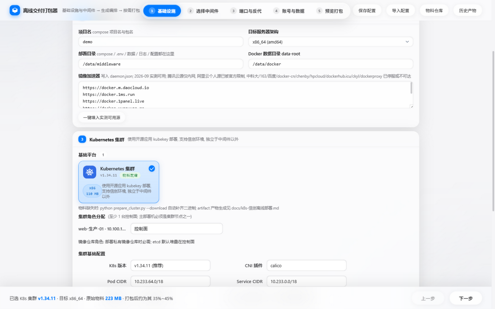

Cluster settings (version / CNI / CIDR / kube-proxy mode in a two-column form), offline
material mode (artifact / binary cache), per-distro OS package selection (Kylin / UOS /
openEuler / Anolis / Alibaba Cloud Linux etc., 9 distros) and node role assignment all
live in the same "deployment topology" area as the MySQL/Redis/Kafka multi-host forms;
renaming a server in the pool updates the role-assignment labels live:

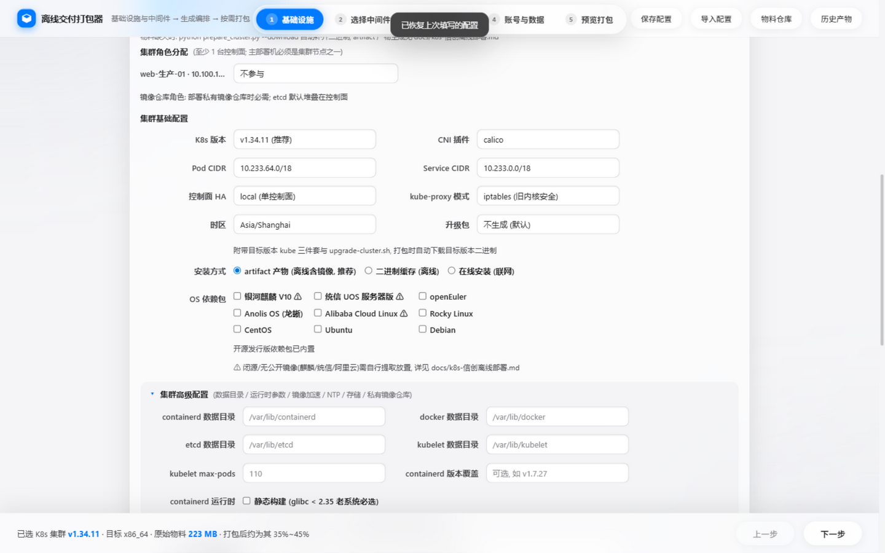

Generate Preview gains "Cluster inventory" and "Cluster config" tabs showing the exact
inventory.yaml / config.yaml that go into the bundle:

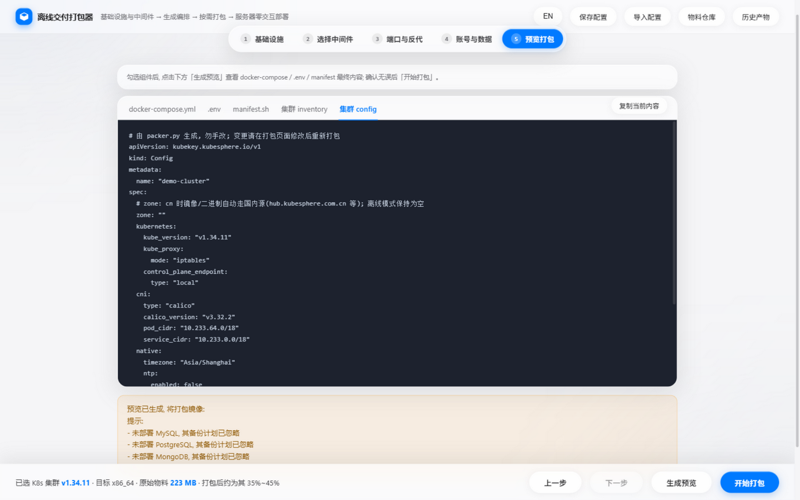

Missing materials are **auto-completed at pack time**: binaries are downloaded from
China-reachable mirrors (with per-component progress); the artifact bundle is built
automatically via Docker Desktop running `kk artifact export` (zone=cn domestic mirrors,
~3-5 minutes measured); only materials that cannot be auto-fetched prompt for a path:

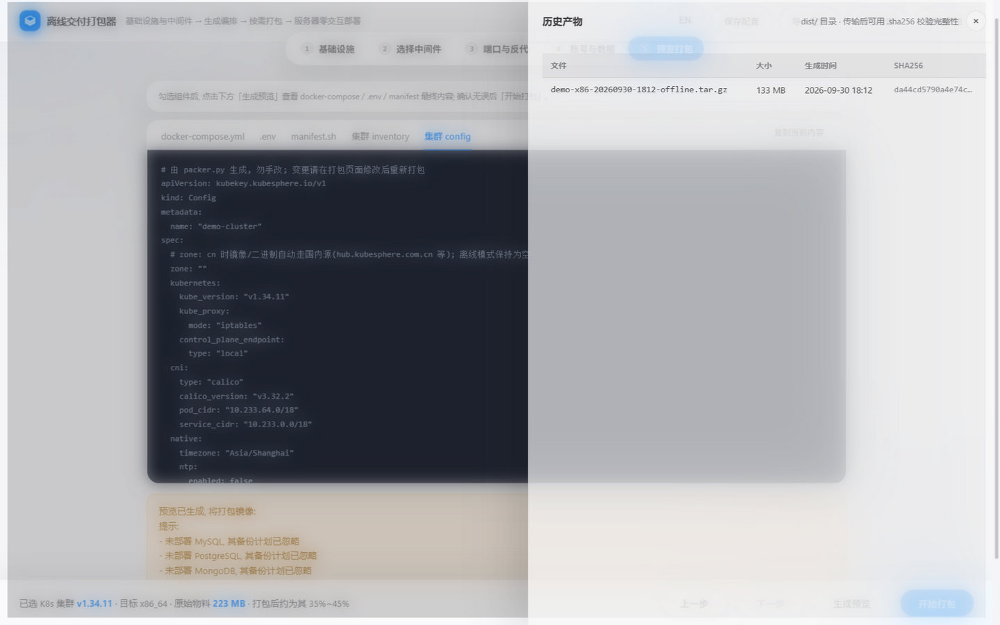

Validated end-to-end with a containerized two-node cluster (Ubuntu 22.04 systemd + SSH):
340 kk tasks with 0 failures, both nodes joined, idempotent re-run passed — see
[docs/k8s-容器验证记录.md](docs/k8s-容器验证记录.md) (Chinese).

Material preparation (patched kk, offline artifact, OS packages) and the Xinchuang
compatibility matrix: [docs/k8s-信创离线部署.md](docs/k8s-信创离线部署.md) ·
[docs/k8s-README.md](docs/k8s-README.md) (Chinese).

## 📚 10. Documentation Index

| Doc | Content |
|---|---|
| [docs/k8s-信创离线部署.md](docs/k8s-信创离线部署.md) | K8s offline/online modes & CN mirror chain (Chinese) |
| [docs/问题修复全记录.md](docs/问题修复全记录.md) | **Single ledger of all project issues** (68 entries: user-reported + self-found + environment, Chinese) |
| [docs/参考文献.md](docs/参考文献.md) | Index of all references: papers/docs/open-source communities (Chinese) |
| [docs/真机重建-进行时.md](docs/真机重建-进行时.md) | Real-machine verification timeline (Chinese) |
| [docs/e2e-docker-全流程测试报告.md](docs/e2e-docker-全流程测试报告.md) | Containerized multi-host E2E report (Chinese) |
| [CHANGELOG.md](CHANGELOG.md) | Release notes |
